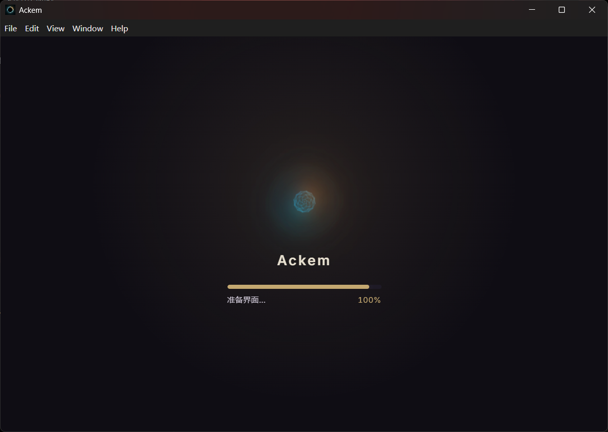
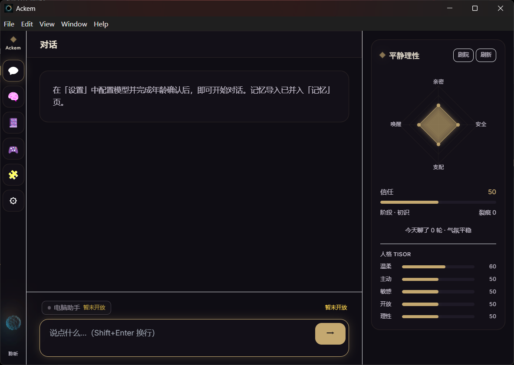
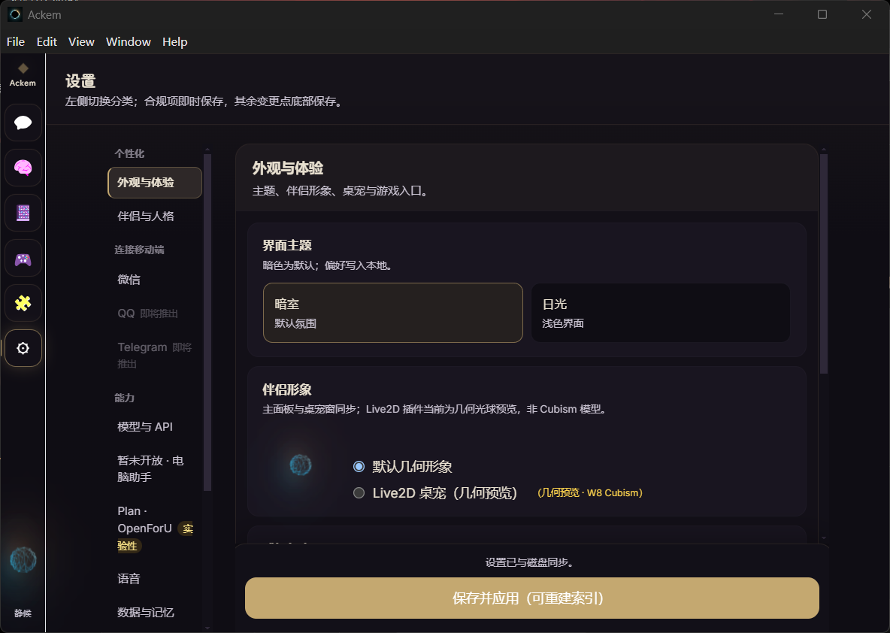
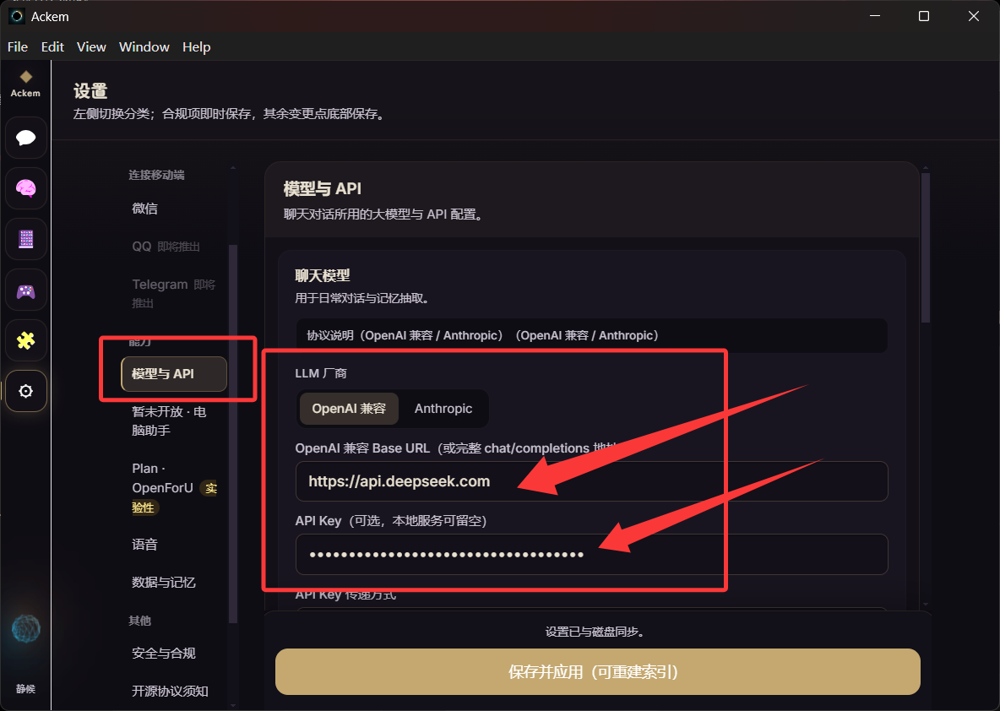
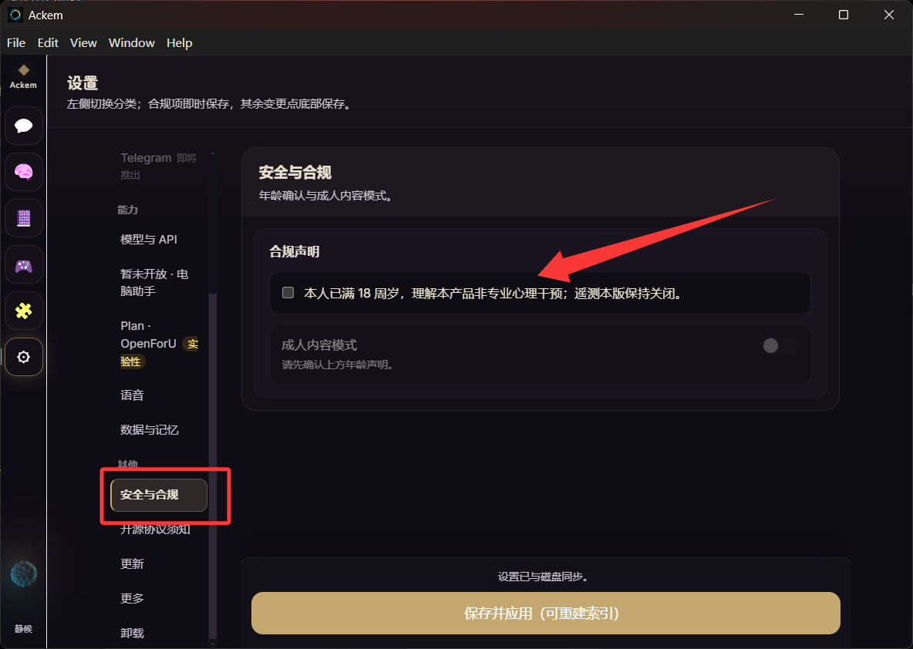

# Ackem

**Ackem v1.0.0** — 运行在你 Windows 电脑上的 AI 伴侣应用。

> **源码仓库**：[GitHub](https://github.com/JasonLiu0826/Ackem) · [Gitee 镜像](https://gitee.com/jason_2005/ackem)  
> **Windows 发行版**：[GitHub Releases](https://github.com/JasonLiu0826/Ackem/releases) · [Gitee Releases](https://gitee.com/jason_2005/ackem/releases)  
> **本地构建**：`npm run dist:green` → `dist/release/Ackem-1.0.0-win-x64/`  
> 路径说明：[docs/CODEBASE-PATHS.md](./docs/CODEBASE-PATHS.md)

English README: [README.md](./README.md) · English user docs: [docs/privacy-and-data.md](./docs/privacy-and-data.md)

---

## 界面预览

<p align="center">
  
  <br /><em>加载界面 — 首次启动时自动解压本地 embedding 模型，进度条完成后进入主界面</em>
</p>

<p align="center">
  
  <br /><em>主页面 — 对话、记忆、游戏、扩展与设置入口；右侧为关系状态与桌宠预览</em>
</p>

<p align="center">
  
  <br /><em>设置界面 — 人格、语音、桌宠、微信通道、扩展与数据管理等选项</em>
</p>

<p align="center">
  
  <br /><em>配置模型 — 填写 Base URL、API Key 与模型 ID，支持云端 OpenAI 兼容接口或本机 Ollama / LM Studio</em>
</p>

<p align="center">
  
  <br /><em>合规勾选 — 首次使用前确认隐私政策、数据处理说明与成人模式相关条款</em>
</p>

---

## 演示

### 下载并打开

<p align="center">
  
  <br /><em>从 Release 下载绿色版 zip → 解压 → 启动 Ackem.exe → 等待加载完成 → 进入主界面</em>
</p>

### 日常对话

<p align="center">
  
  <br /><em>配置好模型后，像和人聊天一样发送消息；Ackem 会结合记忆与关系状态回复</em>
</p>

---

## 项目介绍

Ackem 不是网页聊天框，而是一个 **本地优先** 的 Windows 桌面程序：你配置自己的大模型 API（或本地推理服务），Ackem 负责 **对话、记忆、情绪与关系状态、桌宠陪伴**，并把数据保存在 **你自己的硬盘** 上。

### 你可以用它做什么

- **像和人聊天一样对话** — 支持 OpenAI 兼容接口（云端或本机 Ollama / LM Studio 等）；在 **设置 → 模型与 API** 填写即可。
- **记住你们说过的事** — 对话会写入结构化记忆；可在 **记忆** 页搜索、浏览时间线、查看知识图谱，或 **导入** 自己的 txt / md 文档作为长期记忆。
- **有连续感的陪伴** — Ackem 会维护信任、情绪、关系阶段等状态；可切换人格预设，伴侣也会写 **日记**，并在合适时候主动找你聊几句。
- **不只在主窗口里** — 可最小化到 **系统托盘**，或打开 **桌宠** 小窗贴在桌面；形象可在设置里调整（当前 Live2D 为几何光球预览）。
- **可选能力** — **语音** 识别与播报、**微信** 通道（手机发消息、大脑仍在本机运行，需保持 Ackem 后台运行）、**扩展** 中心的内置提醒与工具；**Plan · OpenForU** 为实验中的扩展创作工作区。
- **游戏模式** — 内置 **游戏** 页，实验中，未开发完全。可与伴侣一起玩支持的游戏（如 Minecraft 等，视扩展启用情况而定）。

### 数据在哪里

绿色版默认把全部个人数据放在 **exe 同级的 `data/`** 文件夹（便携模式）：聊天记录、记忆、日记、设置里的 API Key 等 **都不会随安装包分发**，也 **没有默认上传到 Ackem 服务器的遥测**。官方 zip 里只有程序与模型资源；第一次运行后才会在你本机生成空的 `data/`。

备份、迁移或彻底删除数据，见 [docs/memory-format.md](./docs/memory-format.md) 与 [docs/distribution-windows.md](./docs/distribution-windows.md)。

### 你需要准备什么

1. Windows 10/11 64 位电脑  
2. 一个大模型 API（或本机推理服务）的地址与密钥  
3. 解压绿色版、首次启动等待约 10–30 秒（本地记忆检索用的 embedding 模型会自动解压）

不需要安装 Node.js，也不需要会写代码。

### 给开发者

想改代码、写扩展或参与贡献，请看下方 **「开发者」** 一节，以及 [系统架构（七系统）](#系统架构七系统) 与 [文档索引](#文档)。

---

## 5 分钟上手（终端用户）

适用：**已下载官方 Release**，本机 **无需 Node.js**。

### 隐私说明（必读）

| 官方安装包 / 绿色版 **不含** | 首次运行后 **仅存在你本机** |
|------------------------------|----------------------------|
| 用户记忆、聊天记录、导入文件 | `data/`（便携模式在 exe 旁） |
| API Key、模型凭证 | 设置 → 存于本机 userData |
| 维护者或他人的任何私人数据 | 由你自己配置与写入 |

详见 [docs/distribution-windows.md](./docs/distribution-windows.md)。

### 步骤

1. **下载** — [GitHub Releases](https://github.com/JasonLiu0826/Ackem/releases) 或 [Gitee Releases](https://gitee.com/jason_2005/ackem/releases) 下载 `Ackem-v1.0.0-win-x64.zip`（或当前 Release 资产）
2. **解压** — 完整解压到 SSD 目录（勿在 zip 内直接运行）
3. **启动** — 双击 `Ackem.exe` 或 `启动 Ackem.bat`；首次约 10–30 秒（见上方 [加载界面](#界面预览)）
4. **合规确认** — 勾选隐私与数据处理相关条款（见上方 [合规勾选](#界面预览)）
5. **配置模型** — **设置 → 模型与 API** 中填写 Base URL、API Key（云端必填）、模型 ID
6. **首次对话** — 发送一条消息确认回复；可选导入 txt/md 记忆

---

## 开发者

> Ackem 是 **Electron 应用**，渲染进程依赖 `window.ackem`（preload IPC）。  
> 请用 **`npm run dev`** 启动 Electron，不要在浏览器单独打开 Vite 地址。

### 环境

- Windows 10/11
- Node.js **20+**
- `npm ci`

### 日常开发

```bash
cd Ackem-v0.0.0
npm install
npm run dev
```

开发时 `data/` 在工作目录下，与绿色版 exe 旁的 `data/` 相互独立。

### 构建与打包

```bash
npm run build          # 编译 → out/
npm run dist:green     # 绿色版 → dist/release/
npm run dist:setup     # 可选 NSIS 安装包
```

### 测试

```bash
npm run typecheck
npm test
npm run test:renderer
```

---

## 系统架构（七系统）

| # | 系统 | 说明 | 文档 |
|---|------|------|------|
| ① | 整体 | Electron、orchestrator、一轮对话链路 | [00-overall-system.md](./docs/developer/architecture/00-overall-system.md) |
| ② | 脑 | L0 理解 + L4 记忆检索与衰减 | [01-brain-system.md](./docs/developer/architecture/01-brain-system.md) |
| ③ | 心 | L1 关系 + L2 情绪 + L3 表达 | [02-heart-system.md](./docs/developer/architecture/02-heart-system.md) |
| ④ | 嘴 | Prompt 组装 + LLM 调用 | [03-mouth-system.md](./docs/developer/architecture/03-mouth-system.md) |
| ⑤ | 神经 | Embedding / 向量检索 | [04-neural-system.md](./docs/developer/architecture/04-neural-system.md) |
| ⑥ | 扩展 | Skill/Plugin/Dispatch/OpenForU | [05-extension-system.md](./docs/developer/architecture/05-extension-system.md) |
| ⑦ | 时间 | 时间感知、作息曲线、重逢、感慨 | [06-time-system.md](./docs/developer/architecture/06-time-system.md) |
| — | 数据层 | SQLite 模式、Repository、迁移 | [07-data-layer.md](./docs/developer/architecture/07-data-layer.md) |
| — | IPC 接口 | window.ackem.\* preload 桥、推送事件 | [08-ipc-api.md](./docs/developer/architecture/08-ipc-api.md) |

索引：[docs/developer/architecture/README.md](./docs/developer/architecture/README.md)

---

## 文档

| 用途 | 中文 | English |
|------|------|---------|
| 代码库与产物路径 | — | [docs/CODEBASE-PATHS.md](./docs/CODEBASE-PATHS.md) |
| 开源文档地图 | — | [docs/OPEN-SOURCE-DOC-MAP.md](./docs/OPEN-SOURCE-DOC-MAP.md) |
| 扩展开发者协议 | — | [docs/developer/DEVELOPER-EXTENSION-PROTOCOL.md](./docs/developer/DEVELOPER-EXTENSION-PROTOCOL.md) |
| 开发者环境搭建 | — | [docs/developer/dev-setup.md](./docs/developer/dev-setup.md) |
| 数据目录格式 | [docs/memory-format.zh.md](./docs/memory-format.zh.md) | [docs/memory-format.md](./docs/memory-format.md) |
| AI 上下文与检索策略 | [docs/ai-context-and-retrieval-policy.zh.md](./docs/ai-context-and-retrieval-policy.zh.md) | [docs/ai-context-and-retrieval-policy.md](./docs/ai-context-and-retrieval-policy.md) |
| 隐私与数据处理 | [docs/privacy-and-data.zh.md](./docs/privacy-and-data.zh.md) | [docs/privacy-and-data.md](./docs/privacy-and-data.md) |
| 本地模型配置 | [docs/local-models-windows.zh.md](./docs/local-models-windows.zh.md) | [docs/local-models-windows.md](./docs/local-models-windows.md) |
| 成人模式与安全策略 | [docs/adult-and-safety-policy.zh.md](./docs/adult-and-safety-policy.zh.md) | [docs/adult-and-safety-policy.md](./docs/adult-and-safety-policy.md) |
| 感知能力 | [docs/perception-layer.zh.md](./docs/perception-layer.zh.md) | [docs/perception-layer.md](./docs/perception-layer.md) |
| 敏感能力 | [docs/sensitive-capabilities.zh.md](./docs/sensitive-capabilities.zh.md) | [docs/sensitive-capabilities.md](./docs/sensitive-capabilities.md) |
| Windows 分发 | [docs/distribution-windows.zh.md](./docs/distribution-windows.zh.md) | [docs/distribution-windows.md](./docs/distribution-windows.md) |
| 索引与规模 | — | [docs/indexing-and-scale.md](./docs/indexing-and-scale.md) |
| 安全策略 | [SECURITY.zh.md](./SECURITY.zh.md) | [SECURITY.md](./SECURITY.md) |
| 贡献指南 | [CONTRIBUTING.zh.md](./CONTRIBUTING.zh.md) | [CONTRIBUTING.md](./CONTRIBUTING.md) |
| 行为准则 | [CODE_OF_CONDUCT.zh.md](./CODE_OF_CONDUCT.zh.md) | [CODE_OF_CONDUCT.md](./CODE_OF_CONDUCT.md) |

---

## 许可证

本项目以 [AGPL-3.0](./LICENSE) 协议开源。

| 使用场景 | 是否允许 |
|---------|---------|
| 个人学习与研究 | ✅ 允许 |
| 开源项目集成（需同样以 AGPL-3.0 开源） | ✅ 允许 |
| 学术研究与论文引用 | ✅ 允许 |
| 闭源商业产品 | ❌ 需商业授权 |
| SaaS 服务（不向用户提供源码） | ❌ 需商业授权 |
| 企业私有化部署（不开源） | ❌ 需商业授权 |
| 闭源产品通过 API 调用（不修改源码） | ⚠️ 灰色地带，建议咨询 |

### 商业授权

如需商业授权，请联系：**jasonliu_lyf_2005@qq.com**

### 贡献者协议

向本项目提交贡献，即表示您同意 [贡献者许可协议（CLA）](./CLA.md)。

版权所有 (C) 2026 Jason Liu (JasonLiu0826)

---

*开源版侧重本地 txt/md 与可审计检索。闭源商业部署或 SaaS 场景见 [LICENSE](./LICENSE) 中的商业授权说明。*
