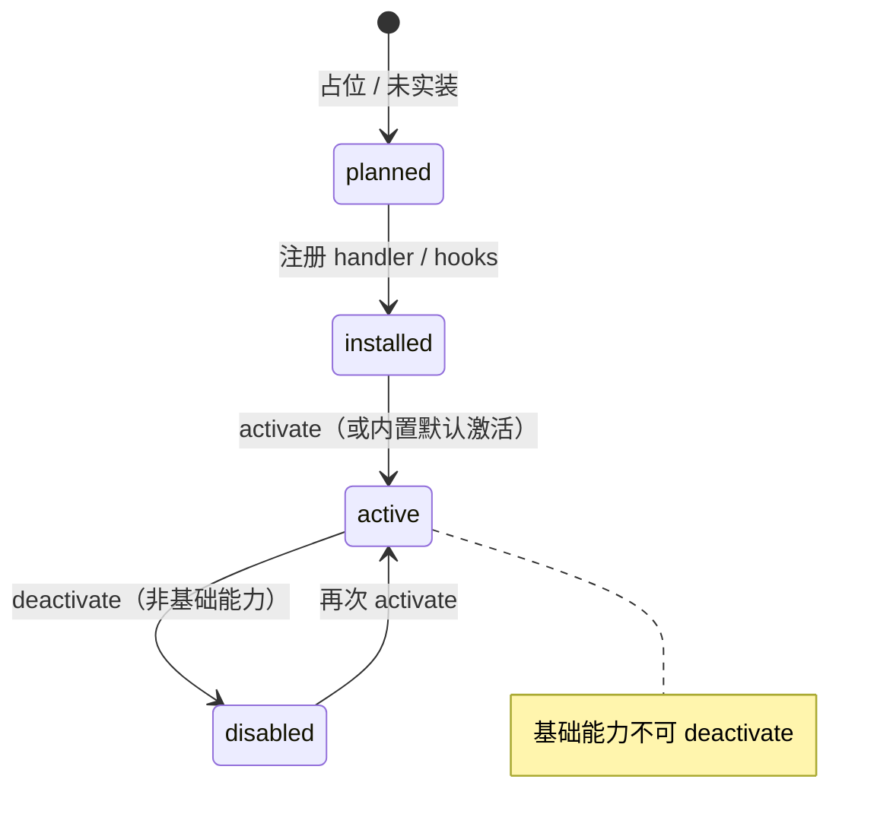

# 扩展可用性策略 — 无 Skill/Plugin 或用户关闭时怎么处理

> 版本：1.0.0 | 最后更新：2026-05-24 凌晨  
> 适用范围：内置 `plugins` / `skills`，以及 OpenForU 的 `uplugins` / `uskills`

---

## 一、一句话原则

**对话运行时：扩展不可用 = 当作「没有这个功能」，走正常聊天；不向用户暴露工程错误。**

用户在扩展中心关闭某能力，表示「这段时间不要走这条链路」，而不是「我要看一条系统报错」。  
因此运行面采用 **fail silent（静默跳过）+ 自然降级**，管理面（扩展中心 IPC）仍可返回明确的成功/失败。

---

## 二、两种「不可用」

| 情况 | registry 状态 | 含义 | 对话层行为 |
|------|---------------|------|------------|
| **未实装 / 未安装** | `planned` 或条目不存在 | 能力尚未接入运行时 | 同「不存在」，正常聊天 |
| **用户关闭** | `disabled` | 已安装但用户主动停用 | 同「不存在」，正常聊天 |
| **异常** | `error` | 激活或执行失败 | 不参与调度；对话层仍不弹工程错误（见下文） |
| **基础能力** | 强制 `active` | Ackem 产品底线，不可关闭 | 始终参与调度（见第三节） |

> **uplugin / uskill** 注册进同一套 `PluginRegistry` / `SkillRegistry`，关闭后行为与内置扩展一致。  
> OpenForU loader 仅额外维护 `data/openforu/` 下的目录与本地镜像状态。

---

## 三、基础能力（例外）

以下 ID 定义在 `src/shared/coreExtensions.ts`，启动时由 `ensureCoreExtensionsActive()` 强制激活，扩展中心不可 `deactivate`：

| 类型 | ID | 名称 |
|------|-----|------|
| Plugin | `ackem/knowledge-presentation@1.0.0` | 知识整理 |
| Skill | `ackem/web-search@1.0.0` | 网页搜索 |
| Skill | `ackem/plan-document@1.0.0` | 计划书 |
| Skill | `ackem/markdown-table@1.0.0` | Markdown 表格 |
| Skill | `ackem/diary-auto@0.1.0` | 日记自动生成 |
| Skill | `ackem/weather-sense@0.0.1` | 天气感知 |
| Skill | `ackem/emergency-companion@1.0.0` | 应急陪伴 |

管理面拒绝关闭时返回：

```typescript
{ ok: false, error: '该功能为 Ackem 基础能力，无法关闭' }
```

---

## 四、两层语义分离

```
┌─────────────────────────────────────────────────────────┐
│  管理面（扩展中心 / ext:* IPC）                            │
│  activate / deactivate → ExtensionOpResult { ok, error } │
│  用户需要知道：开关是否成功、基础能力为何不能关              │
└─────────────────────────────────────────────────────────┘
                            │
                            ▼
┌─────────────────────────────────────────────────────────┐
│  运行面（对话 / 调度 / LLM tools）                         │
│  不可用扩展 ≡ 不存在 → 静默跳过 → 正常 companion 聊天       │
│  不在气泡里写「Skill 未激活」「插件已关闭」                  │
└─────────────────────────────────────────────────────────┘
```

---

## 五、运行面：各入口统一行为

### 5.1 Skill（含 uskill）

| 入口 | 不可用时的行为 | 主要代码 |
|------|----------------|----------|
| LLM 工具列表 | 不出现在 `getFunctionDefs()` | `skills/registry.ts` |
| 关键词触发 | `matchByKeyword` 跳过 inactive | `skills/registry.ts` |
| Dispatch 候选 / 显式 invoke | catalog 过滤 `status !== 'active'` | `dispatch/candidateCollector.ts`, `dispatch/explicitDispatch.ts` |
| Autonomous 定时 | scheduler 只跑 active | `dispatch/scheduler.ts` |
| 硬调 `skills.execute()` | 返回 `{ ok: false, error: "Skill '…' 未激活" }`（**仅内部**；勿原样展示给用户） | `skills/registry.ts` |
| LLM 误调已关闭工具 | `findByFunctionName` 找不到 → 上层走兜底，不中断对话 | `chatSkillTools.ts` |

**用户侧体验示例：**

- 关闭了「网页搜索」→ 用户说「帮我搜一下 XX」→ 不联网、不出搜索纸面卡，按普通聊天回答（模型知识 + 伴侣语气）。
- 关闭了「久坐提醒」→ 定时 tick 不触发，用户无感知。

### 5.2 Plugin（含 uplugin）

| 入口 | 不可用时的行为 | 主要代码 |
|------|----------------|----------|
| Dispatch 调度 | 同 Skill，catalog 过滤 inactive | `coordinator.getDispatchCatalog()` |
| 生命周期 hook | `deactivate` 调 `onUnload` 清理；**调度层不应再调 hook** | `plugins/registry.ts` |
| UI 类插件（如伴侣皮肤） | inactive 回退内置默认（如 Canvas 皮肤） | `plugins/companionSkin.ts` |
| `beforeUserMessage` 等 | 仅 `status === 'active'` 时执行 | `dispatch/dispatchExecutor.ts`（须校验 status） |

Plugin 没有统一的 `execute()`；**关闭 = 从调度集合移除 + hook 不再注入上下文**。

### 5.3 规划中（`planned`）

- 扩展中心显示「规划中」，**不可 activate**。
- 运行时与「不存在」相同：不参与任何调度、不出现在 tools 列表。

---

## 六、状态机（简化）



---

## 七、开发者约定（新增扩展时必须遵守）

1. **所有触发路径**在调用扩展前检查 `instance.status === 'active'`（或通过 registry 的 `listActive*` / 已过滤的 catalog）。
2. **不要在 assistant 气泡**里输出「未激活 / 已关闭 / Skill 执行失败」等内部文案；失败时降级为普通回复。
3. **`skills.execute` 的 error 字段**仅供日志与 tool result 内部传递；`chatSkillTools` 层应收敛为用户可理解的短句，或干脆不注入 tool 结果、让 LLM 正常续聊。
4. **硬编码 bypass**（ipc 里直接走某插件逻辑）也必须查 registry active；否则会出现「扩展中心已关但仍触发」的 bug。
5. **基础能力**写入 `src/shared/coreExtensions.ts`，并在 manifest 打 `core` tag；扩展中心 UI 用 `isCoreExtension()` 隐藏关闭按钮。

---

## 八、与用户显式点名的关系

即使用户说「帮我搜一下」「整理一下」，若对应扩展已关闭：

- **推荐**：仍按「没有这个功能」处理 → 正常聊天，不在对话里解释「你去扩展中心关掉了 XX」。
- **可选（产品层）**：扩展中心列表仍显示「已关闭」；若未来要做 toast，仅在不打断聊天的侧栏/Toast 提示，**不写入 assistant 消息**。

---

## 九、相关文件索引

| 文件 | 职责 |
|------|------|
| `src/shared/coreExtensions.ts` | 基础能力 ID 与 `isCore*` 判断 |
| `src/main/extensions/ensureCoreExtensions.ts` | 启动时强制激活基础能力 |
| `src/main/extensions/skills/registry.ts` | Skill 激活/执行/工具列表 |
| `src/main/extensions/plugins/registry.ts` | Plugin 激活/禁用/卸载 |
| `src/main/extensions/openforu/loader.ts` | uplugin / uskill 启停 |
| `src/main/extensions/dispatch/*` | 调度候选与 autonomous tick |
| `src/main/chatSkillTools.ts` | LLM function call 与 Skill 桥接 |
| `src/renderer/src/components/extensionTypes.ts` | 扩展中心「基础功能」展示 |

---

## 十、修订记录

| 日期 | 说明 |
|------|------|
| 2026-05-24 凌晨 | 与 `_5_28` 文档基线对齐；补充基础能力完整列表 |
| 2026-05-24 凌晨 | 初版：确立「不可用 = 不存在 → 正常聊天」策略 |
