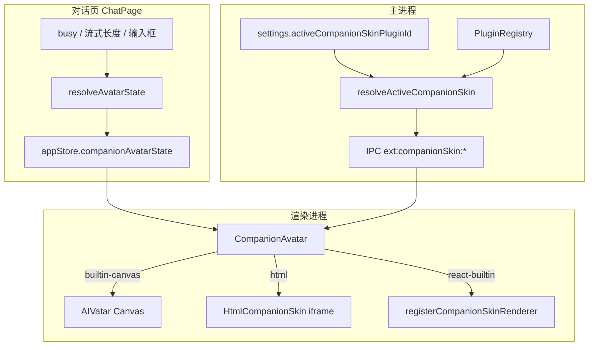
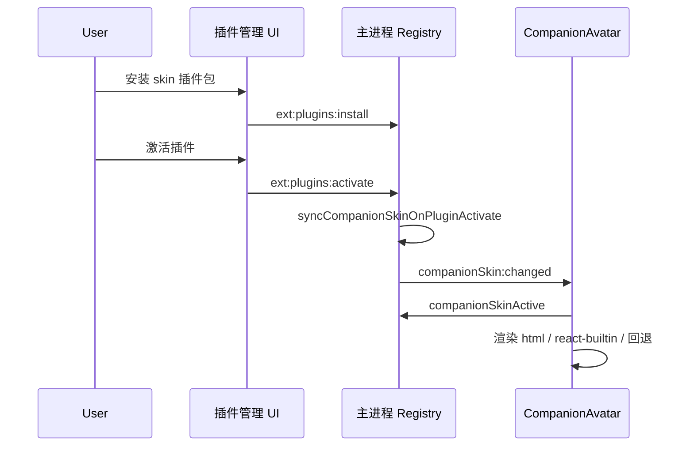

# 伴侣交互形象皮肤（companionSkin）开发说明

本文档说明 Ackem 主界面左侧 **伴侣交互形象** 的扩展机制：默认使用内置 Canvas 几何形象（`AIVatar`），`pluginType: "skin"` 的插件可通过 `manifest.companionSkin` 声明并覆盖该形象。

---

## 1. 功能概述

| 项目 | 说明 |
|------|------|
| **显示位置** | 左侧导航栏（`NavBar`）底部，全应用各标签页可见 |
| **默认形象** | `AIVatar`：中心蜂窝线框小球 + 立体呼吸光晕，无实心背景 |
| **状态驱动** | 与对话页联动：`idle` / `listening` / `thinking` / `speaking` |
| **扩展方式** | 安装并激活声明了 `companionSkin` 的 skin 插件 |
| **回退策略** | 未配置、插件未激活、入口文件缺失、React 未注册时，自动回退内置 `AIVatar` |

皮肤插件只负责 **「长什么样」**，不直接修改引擎情绪、记忆或对话逻辑（与扩展系统 README 中 Plugin 定位一致）。

---

## 2. 架构与数据流



### 2.1 状态从哪里来

`ChatPage` 根据当前会话实时计算形象状态，并写入 `appStore.companionAvatarState`：

| 条件 | `CompanionAvatarState` |
|------|------------------------|
| 正在等待/生成回复，且尚无 assistant 正文 | `thinking` |
| 正在流式输出 assistant 正文 | `speaking` |
| 未在生成，但输入框有未发送文字 | `listening` |
| 其他 | `idle` |

逻辑见：`src/renderer/src/components/resolveAvatarState.ts`。

离开对话页时，`companionAvatarState` 会在 `ChatPage` 卸载时重置为 `idle`；NavBar 中的形象仍显示，但动画回到静候。

### 2.2 皮肤从哪里来

1. 读取用户设置 `activeCompanionSkinPluginId`
2. 在 `PluginRegistry` 中查找对应插件，且状态必须为 **`active`**
3. 解析 `manifest.companionSkin`，生成 `CompanionSkinBinding`
4. 通过 `window.ackem.companionSkinActive()` 下发给 `CompanionAvatar`

激活带 `companionSkin` 的 skin 插件时，主进程会自动把该插件 id 写入 `activeCompanionSkinPluginId`，并向所有窗口发送 `companionSkin:changed` 事件。

---

## 3. 类型与 manifest 规范

共享类型定义：`src/shared/companionSkin.ts`。

### 3.1 形象状态 `CompanionAvatarState`

```ts
type CompanionAvatarState = 'idle' | 'listening' | 'thinking' | 'speaking'
```

插件侧应据此切换动画，而不是自行解析聊天 IPC。

### 3.2 manifest 字段 `companionSkin`

```ts
interface CompanionSkinManifest {
  /** 渲染后端 */
  renderer: 'html' | 'react-builtin'
  /** html：相对插件根目录；react-builtin：渲染进程注册表 key */
  entry: string
  /** 可选：覆盖 NavBar 底部状态文案 */
  statusLabels?: Partial<Record<CompanionAvatarState, string>>
}
```

完整 manifest 仍需满足插件通用规范（`id`、`pluginType: "skin"`、`permissions` 等），见 `src/main/extensions/plugins/manifest.schema.json`。

### 3.3 完整 manifest 示例

```json
{
  "id": "myorg/my-avatar-skin@1.0.0",
  "name": "我的动态形象",
  "version": "1.0.0",
  "category": "plugin",
  "pluginType": "skin",
  "description": "自定义伴侣左侧交互形象",
  "author": "Your Name",
  "license": "MIT",
  "main": "index.js",
  "engineVersion": ">=0.1.0 <1.0.0",
  "permissions": ["readonly"],
  "companionSkin": {
    "renderer": "html",
    "entry": "skin/index.html",
    "statusLabels": {
      "idle": "待机",
      "listening": "在听",
      "thinking": "在想",
      "speaking": "在说"
    }
  }
}
```

JSON Schema 已包含 `companionSkin` 可选字段（同目录上级 `manifest.schema.json`）。

---

## 4. 三种渲染方式

### 4.1 内置默认 `builtin-canvas`（无需插件）

- 组件：`src/renderer/src/components/AIVatar.tsx`
- 特征：Canvas 蜂窝核心 + 多层呼吸光晕 + 鼠标视差
- 当 `activeCompanionSkinPluginId` 为空、插件未激活或解析失败时使用

**应用内请统一使用 `CompanionAvatar`，不要直接引用 `AIVatar`**，否则插件覆盖不会生效。

### 4.2 HTML 皮肤 `html`（推荐第三方插件）

适用于：Live2D 导出页、Spine Web、纯 CSS/Canvas 动画、独立前端资源包。

**目录约定示例：**

```
data/extensions/plugins/myorg_my-avatar-skin@1.0.0/
  manifest.json
  skin/
    index.html
    avatar.js
    style.css
```

**manifest：**

```json
"companionSkin": {
  "renderer": "html",
  "entry": "skin/index.html"
}
```

**运行时行为：**

- 主进程将 `entry` 解析为 `file://` 绝对 URL
- 渲染进程用 `<iframe sandbox="allow-scripts allow-same-origin">` 加载
- 每次 `state` 变化时向 iframe 发送：

```js
// 父窗口 → iframe
{ type: 'ackem:companion-avatar', state: 'idle' | 'listening' | 'thinking' | 'speaking' }
```

**最小 HTML 皮肤示例：**

```html
<!DOCTYPE html>
<html lang="zh-CN">
<head>
  <meta charset="UTF-8" />
  <style>
    html, body { margin: 0; width: 100%; height: 100%; background: transparent; overflow: hidden; }
    #core {
      width: 48px; height: 48px; margin: 40px auto;
      border-radius: 50%;
      background: radial-gradient(circle, #22d3ee 0%, transparent 70%);
      transition: transform 0.3s ease, opacity 0.3s;
    }
    #core.listening { transform: scale(1.08); }
    #core.thinking { animation: spin 2s linear infinite; }
    #core.speaking { animation: pulse 0.5s ease-in-out infinite alternate; }
    @keyframes spin { to { transform: rotate(360deg); } }
    @keyframes pulse { from { transform: scale(1); } to { transform: scale(1.15); } }
  </style>
</head>
<body>
  <div id="core"></div>
  <script>
    const el = document.getElementById('core')
    window.addEventListener('message', (e) => {
      const msg = e.data
      if (!msg || msg.type !== 'ackem:companion-avatar') return
      el.className = msg.state
    })
  </script>
</body>
</html>
```

**注意：**

- 背景请保持透明，以融入 NavBar 的 `bg-surface-raised`
- iframe 尺寸由宿主传入（默认约 128×128），内容请做自适应
- 不要使用需要跨域联网且未在权限中声明的能力；`skin` 类型通常仅 `readonly`

### 4.3 React 内置皮肤 `react-builtin`（随 Ackem 发版的重型皮肤）

适用于：Live2D、复杂 React 组件等 **必须打进主应用包** 的实现。

**manifest（`entry` 建议与插件 `id` 一致）：**

```json
"companionSkin": {
  "renderer": "react-builtin",
  "entry": "ackem/live2d-desktop@0.0.1"
}
```

**在渲染进程注册组件：**

文件：`src/renderer/src/companionSkin/registerBuiltins.ts`

```ts
import { registerCompanionSkinRenderer } from './registry'
import { Live2dCompanionSkin } from '...' // 你的组件

registerCompanionSkinRenderer('ackem/live2d-desktop@0.0.1', Live2dCompanionSkin)
```

**组件 Props 契约：**

```ts
type CompanionSkinComponentProps = {
  state: CompanionAvatarState
  size?: number           // 默认 128
  parallaxStrength?: number
  className?: string
}
```

若注册表中没有对应 key，`CompanionAvatar` 会 **静默回退** 到 `AIVatar`，并在控制台无额外报错（便于占位插件未实装时仍可运行）。

---

## 5. 宿主组件 API

### 5.1 React 使用

```tsx
import { CompanionAvatar } from './components/CompanionAvatar'

<CompanionAvatar
  state={avatarState}
  size={128}
  parallaxStrength={0.1}
  className="pointer-events-auto"
/>
```

| Prop | 类型 | 默认 | 说明 |
|------|------|------|------|
| `state` | `CompanionAvatarState` | `'idle'` | 当前动画状态 |
| `size` | `number` | `128` | 宽高（像素） |
| `parallaxStrength` | `number` | `0.12` | 仅内置 Canvas 有效，鼠标视差弧度 |
| `className` | `string` | `''` | 外层样式 |
| `showStatus` | `boolean` | `false` | 是否在组件内显示状态文案 |

NavBar 在外层单独显示状态文字，故 `showStatus={false}`。

### 5.2 渲染进程 `window.ackem` API

类型声明：`src/renderer/src/ackem.d.ts`。

| 方法 | 返回值 | 说明 |
|------|--------|------|
| `companionSkinActive()` | `Promise<CompanionSkinBinding>` | 当前应使用的皮肤绑定 |
| `companionSkinList()` | `Promise<CompanionSkinBinding[]>` | 可选列表（含默认项） |
| `companionSkinSetActive(pluginId \| null)` | `Promise<{ ok: boolean }>` | 手动切换；`null` 恢复默认 |
| `onCompanionSkinChanged(fn)` | `void` | 订阅皮肤变更（激活/停用/手动切换） |

`CompanionSkinBinding` 示例：

```ts
{
  pluginId: 'ackem/live2d-desktop@0.0.1',
  pluginName: 'Live2D 桌宠',
  renderer: 'react-builtin', // 或 'html' | 'builtin-canvas'
  entry: 'ackem/live2d-desktop@0.0.1', // html 时为 file:// URL
  statusLabels: { idle: '待机', ... }
}
```

### 5.3 主进程 IPC（供 preload / 调试）

| 通道 | 说明 |
|------|------|
| `ext:companionSkin:active` | 同 `companionSkinActive` |
| `ext:companionSkin:list` | 同 `companionSkinList` |
| `ext:companionSkin:setActive` | 同 `companionSkinSetActive` |

插件激活/停用时还会触发渲染进程事件：**`companionSkin:changed`**（无需传 payload，收到后重新调用 `companionSkinActive` 即可）。

相关实现：`src/main/extensions/plugins/companionSkin.ts`、`src/main/extensions/ipc.ts`。

---

## 6. 设置持久化

| 字段 | 位置 | 说明 |
|------|------|------|
| `activeCompanionSkinPluginId` | `AppSettings`（`src/shared/types.ts`） | 当前覆盖形象的插件 id；`undefined` 表示默认 Canvas |

**自动同步规则：**

- 激活插件且 `manifest.companionSkin` 存在 → 写入该插件 id
- 停用当前正在使用的皮肤插件 → 清空该字段
- 手动调用 `companionSkinSetActive(null)` → 恢复默认

设置文件路径与 Ackem 其他偏好相同（Electron `userData` 下的 `ackem-app-settings.json`）。

---

## 7. 插件生命周期建议



**建议：**

1. 一个时刻只激活 **一个** 带 `companionSkin` 的 skin 插件（后激活的会覆盖 `activeCompanionSkinPluginId`）
2. `html` 皮肤发布前确认 `entry` 文件存在于插件包内
3. `react-builtin` 必须在 Ackem 发版时完成 `registerCompanionSkinRenderer`，仅上传插件 zip 无法单独生效

---

## 8. 源码索引

| 路径 | 职责 |
|------|------|
| `src/shared/companionSkin.ts` | 共享类型、默认状态文案 |
| `src/main/extensions/plugins/companionSkin.ts` | 解析、设置同步、变更通知 |
| `src/main/extensions/plugins/types.ts` | `PluginManifest.companionSkin` |
| `src/main/extensions/ipc.ts` | IPC 注册 |
| `src/renderer/src/components/CompanionAvatar.tsx` | 统一插槽 |
| `src/renderer/src/components/AIVatar.tsx` | 默认 Canvas 形象 |
| `src/renderer/src/components/HtmlCompanionSkin.tsx` | HTML iframe 宿主 |
| `src/renderer/src/companionSkin/registry.ts` | React 皮肤注册表 |
| `src/renderer/src/companionSkin/registerBuiltins.ts` | 内置 React 皮肤注册入口 |
| `src/renderer/src/components/resolveAvatarState.ts` | 聊天状态 → 形象状态 |
| `src/renderer/src/store/appStore.ts` | `companionAvatarState` |
| `src/renderer/src/components/NavBar.tsx` | 形象展示位置 |
| `src/preload/index.ts` | `window.ackem` 桥接 |

---

## 9. 常见问题

### Q1：激活了皮肤插件，界面仍是默认几何形象？

按顺序检查：

1. 插件状态是否为 **`active`**（非仅 `installed`）
2. `manifest.companionSkin` 是否拼写正确
3. `html`：`entry` 文件是否存在于 `data/extensions/plugins/<sanitized-id>/` 下
4. `react-builtin`：是否在 `registerBuiltins.ts` 中注册了与 `entry` 相同的 key
5. 调用 `companionSkinActive()` 看返回的 `renderer` 与 `entry`

### Q2：HTML 皮肤收不到状态？

- 确认监听了 `message` 且判断 `data.type === 'ackem:companion-avatar'`
- 页面脚本是否在 iframe 内执行（`sandbox` 已允许 `allow-scripts`）
- 首帧可在 `load` 事件里先默认 `idle`，等待第一条 postMessage

### Q3：能否在皮肤里直接读引擎情绪？

`companionSkin` 当前 **只传递** `CompanionAvatarState` 四态。若需情绪四维、关系阶段等，应：

- 使用 `engine_read` 权限的插件钩子读取 `EngineSnapshot`（主进程），或
- 后续版本扩展 postMessage / IPC 协议（尚未实现）

### Q4：桌宠（desktop-float）与左侧形象是同一个吗？

不是。`desktop-float` 等占位插件面向 **桌面悬浮窗**；`companionSkin` 仅覆盖 **主窗口左侧 NavBar** 形象。二者可并存，manifest 职责不同。

---

## 10. 插件作者检查清单

- [ ] `pluginType` 为 `"skin"`
- [ ] 已声明 `companionSkin.renderer` 与 `companionSkin.entry`
- [ ] `html`：入口 HTML 在插件包内且路径正确
- [ ] `react-builtin`：已在 `registerBuiltins.ts` 注册，且 `entry` 与注册 key 一致
- [ ] 动画逻辑覆盖四种 `CompanionAvatarState`
- [ ] 背景透明，适配浅色 NavBar
- [ ] 激活插件后 NavBar 形象已切换（或调用 `companionSkinSetActive` 验证）
- [ ] （可选）配置 `statusLabels` 与动画语义一致

---

## 11. 与内置占位插件的关系

`src/main/extensions/plugins/builtin/skin/` 目录下占位插件（如 `live2d-desktop`、`desktop-float`）在 CATALOG 中有编号说明。其中：

- **已预留 `companionSkin` 的**：如 `live2d-desktop`（`react-builtin`，待实装组件注册）
- **未声明 `companionSkin` 的**：如 `screen-effects`、`speech-bubble`，不接管左侧形象

实装步骤仍遵循 `CATALOG.md`：实现 `register.ts` → 在 `register-placeholders.ts` 与 `coordinator.boot()` 中接线。

---

## 12. 版本与扩展

| 版本 | 说明 |
|------|------|
| 当前 | `companionSkin` v1：`html` + `react-builtin` + 默认 Canvas 回退 |

**可能的后续扩展（尚未实现）：**

- 向 HTML 皮肤传递 `emotion` / `relationship` 快照
- 设置页「形象皮肤」下拉与预览
- 支持远程 URL 皮肤（需 `network_outbound` 与 CSP 策略）
- 卸载插件时自动迁移回默认并提示用户

如有协议变更，应同步更新 `src/shared/companionSkin.ts` 与本文件。
